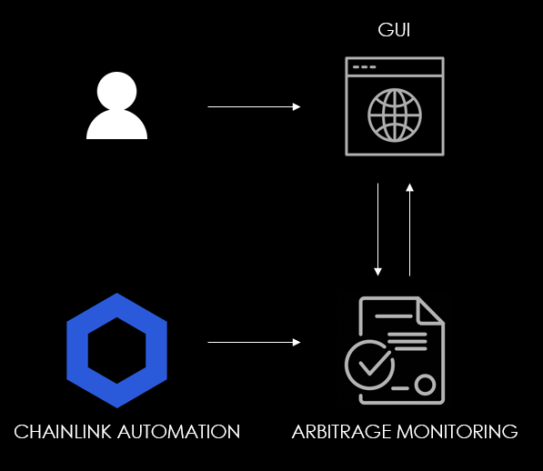

# MONITORING ARBITRAGE OPPORTUNITIES: A CHAINLINK FALL 22 HACKATHON PROJECT

# Overview

Arbitrage opportunities have long been searched for by traders ever since traditional finance. With DeFi, more than ever have such opportunities risen and with them, people who crave for the economical benefits that come with arbitrage.

## Problems: 
1) Spotting arbitrage opportunities is one of the core difficulties that traders encounter,
2) Relying on third-party, centralized services that promise gains simply puts all the power in the hands of such services, which are then capable of handling traders' funds and arbitrage opportunities as they desire.

## Our idea:
1) We build a blockchain-based monitoring service that gathers the price of token pairs directly from the Decentralized Exchanges' routers.
2) We leverage on the Smart Contract Automation feature from Chainlink to frequently update the pairs' prices in order to spot arbitrage opportunities.

This way, our solution is fully decentralized and does not require any user to trust a third party or centralized service, neither from a personal point of view (no need to trust a service that hold all power in terms of spotting arbitrage opportunities), nor from a technical point of view (from point 2, we do not need to rely on cloud services or other traditional centralized solutions to keep the monitoring service running). 

What's more, we provide traders with a way to spot such opportunities while canceling the burden of having to write a specific arbitrage monitor themselves.

# Implementation

The arbitrage_monitoring.sol file contains the current logic behind our monitoring service:
1) The contract owner adds or removes liquidity pairs that the smart contract is able to monitor (achieved with the "addLiquidityPool" and "removeLiquidityPool" functions),
2) By interacting with the smart contract, any user can check the price data coming from all exchanges allowed by the smart contract (achieved by the "getPriceBofA" function),
3) Given a specific token pair, the "isArbitrage" function is in charge of returning the best arbitrage opportunity (if any) along with the exchanges routers address, the token prices and the price delta.

The above points have been developed during the Hackathon and are the subject of this project's submission. 

The smart contract is currently deployed on BSC Testnet at the address 0x86b8A7445dA9acF40A6D2B244c5b8f1b44F62274.

Because of time constraints related to the Hackathon deadline, we were not able to complete the development of the whole process, which would take the following form:

1) A user enters the project's GUI and selects which token pairs to monitor,
2) Through Chainlink's Smart Contract Automation feature, the arbitrage_monitoring.sol continuously calls the "isArbitrage" function which, since it only reads data from the blockchain, is gasless, 
3) The backend then returns the result of "isArbitrage",
4) The frontend shows the arbitrage opportunity.

# Example case

In order to demonstrate how the arbitrage_monitoring.sol contract works, we provide below the address of two tokens and the routers of two exchanges on BSC Testnet:

BNB address on BSC Testnet: 0xae13d989daC2f0dEbFf460aC112a837C89BAa7cd

ETH address on BSC Testnet: 0x8BaBbB98678facC7342735486C851ABD7A0d17Ca

Pancakeswap router address on BSC Testnet: 
0x9Ac64Cc6e4415144C455BD8E4837Fea55603e5c3

Apeswap router address on BSC Testnet: 0x3380aE82e39E42Ca34EbEd69aF67fAa0683Bb5c1

# Further improvements: open points and how we will address them

We will continue developing the arbitrage monitoring service as follows:

1) We build the GUI to dramatically increase the user experience,
2) We integrate the Smart Contract Automation feature to continuously interact with the smart contract,
3) We upgrade the arbitrage_monitoring.sol contract in such a way that different users are able to monitor different token pairs of their choice,
4) We allow for an automated procedure (ideally, another smart contract) to continuously update the list of token pairs and exchange routers to monitor.

# Project contributors

1) Lord Reya (Discord: Lord Reya#4273)
2) Zorjay (Discord: Zorj#2196)
